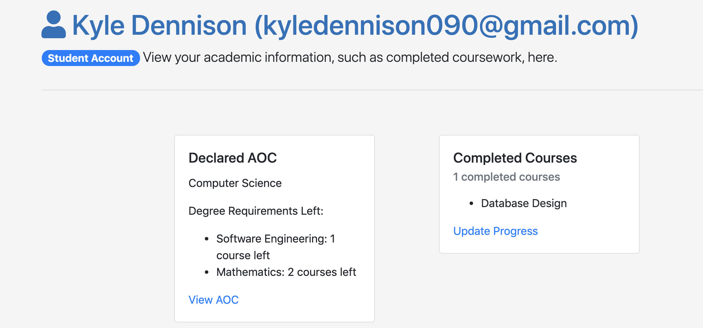
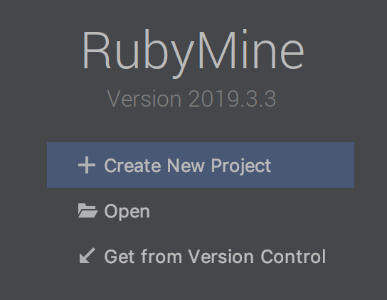

# Degree Planner Website

This repository is a copy of the private original repository, that was moved here for organizational reasons. This is a group project that was worked on with other students for a Software Engineering course from April to May 2019. The goal of this project was to work as a team to practice agile principles and create a live website that colleges can use for their students/faculty to manage progress through majors. This was accomplished using Ruby on Rails to create the site and Heroku to host it. As the front end developer for this project it was my responsibility to make sure the website had a pleasant looks and feel which was refined using user testing. 

### Getting Started 

To run this project open RubyMine and get new project from version control 

Then copy and paste this repo's URL to checkout the code 

Make sure you are using Ruby (version 2.6.0) on Rails (version 5.2.3)

You may need to install the gems used: Devise (User Authentication) and Pundit (User Authorisation) by running "bundle install" in the console 

To develop this code locally make sure to seed the database by running "rails db:seed" in the console
To reset the local database run "rails db:reset" in the console
You may also need to migrate the database by running "rails db:migrate" in console

### Built With 

* RubyMine - IDE
* Ruby - Programming Language 
* Rails - Web Application Framework
* Heroku - Cloud Platform

### Authors 

* Kyle Dennison - KyleDennison
* Chief Nelson - Therizno
* William Pembleton - Iotaslair
* Shane Archuleta - mathshane

